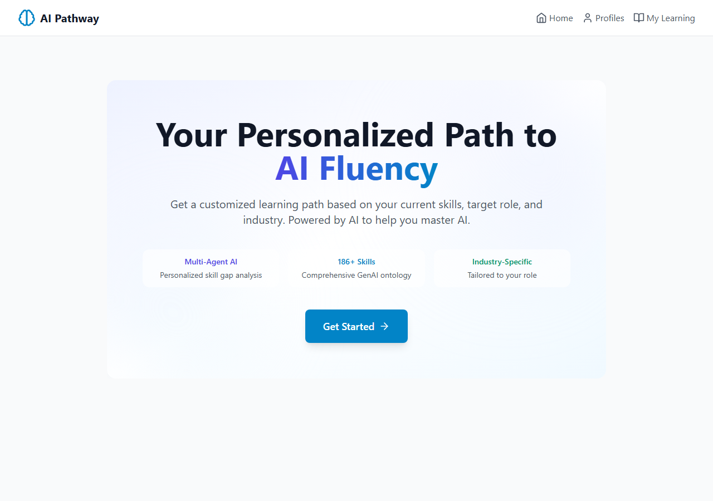
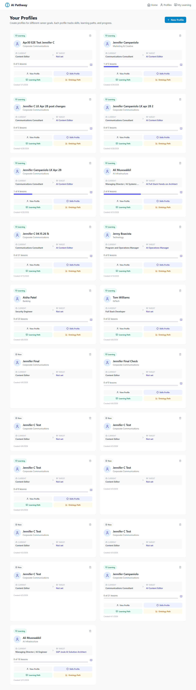
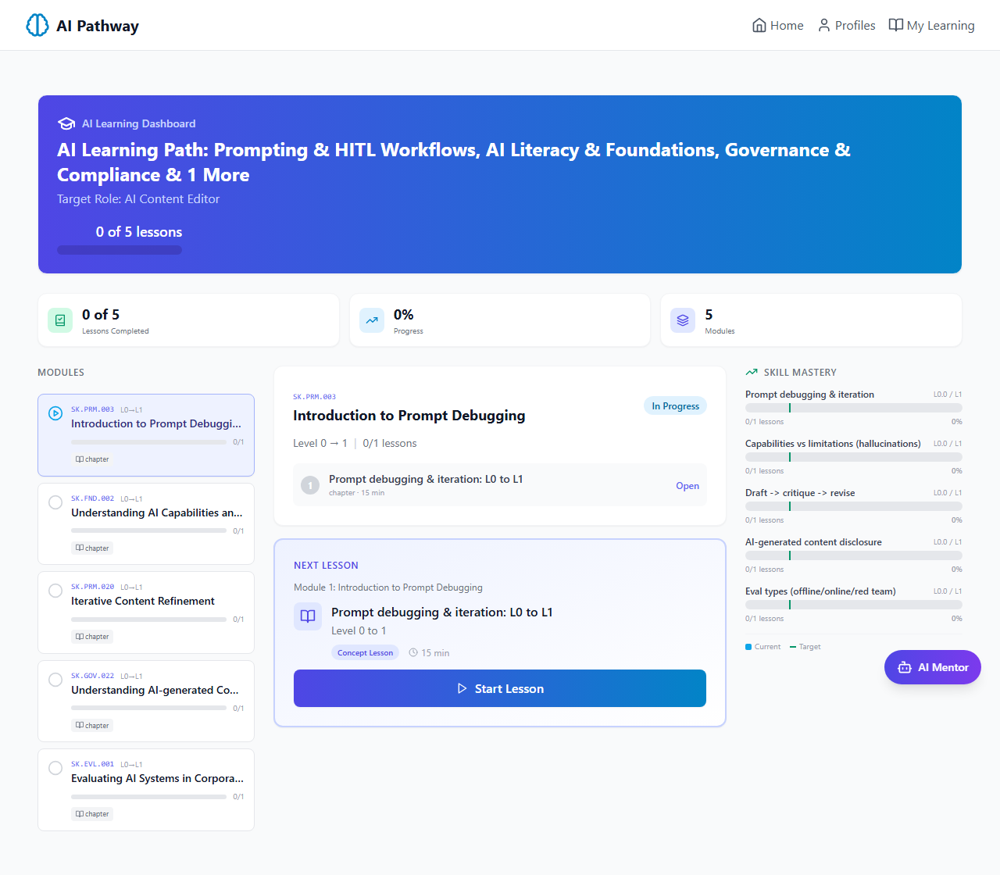
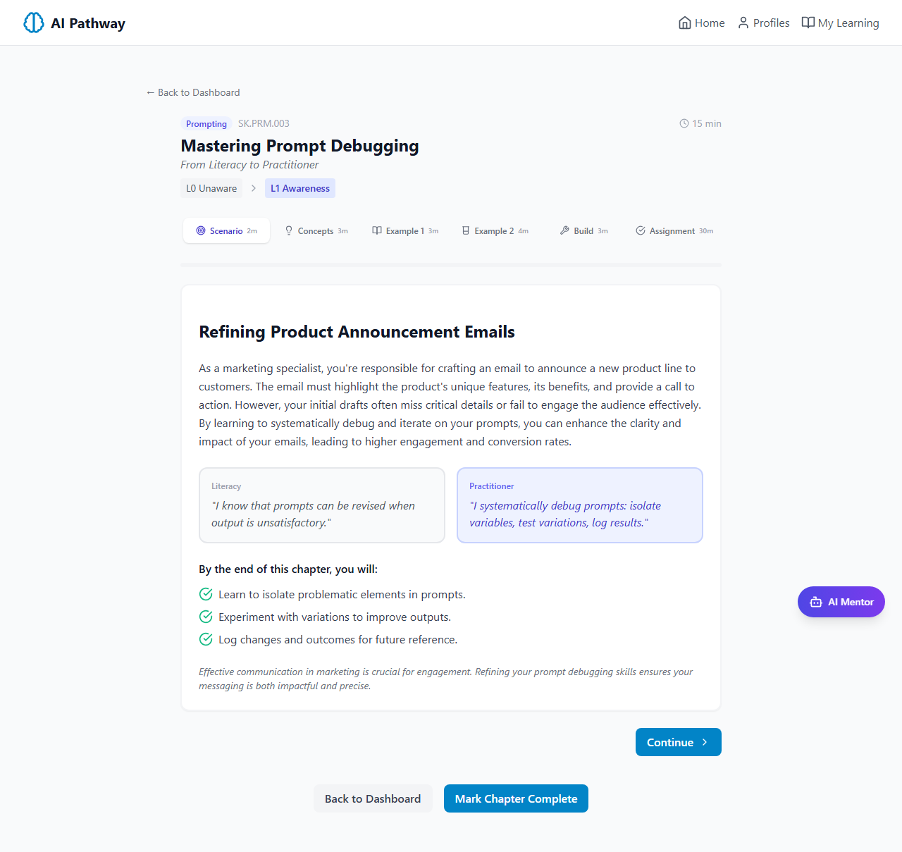
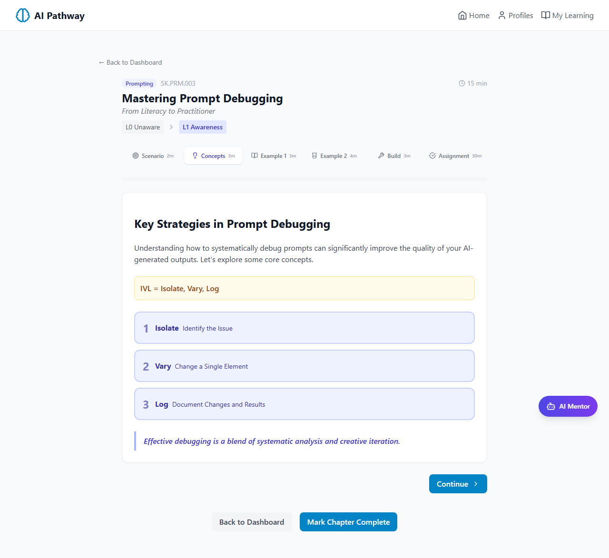
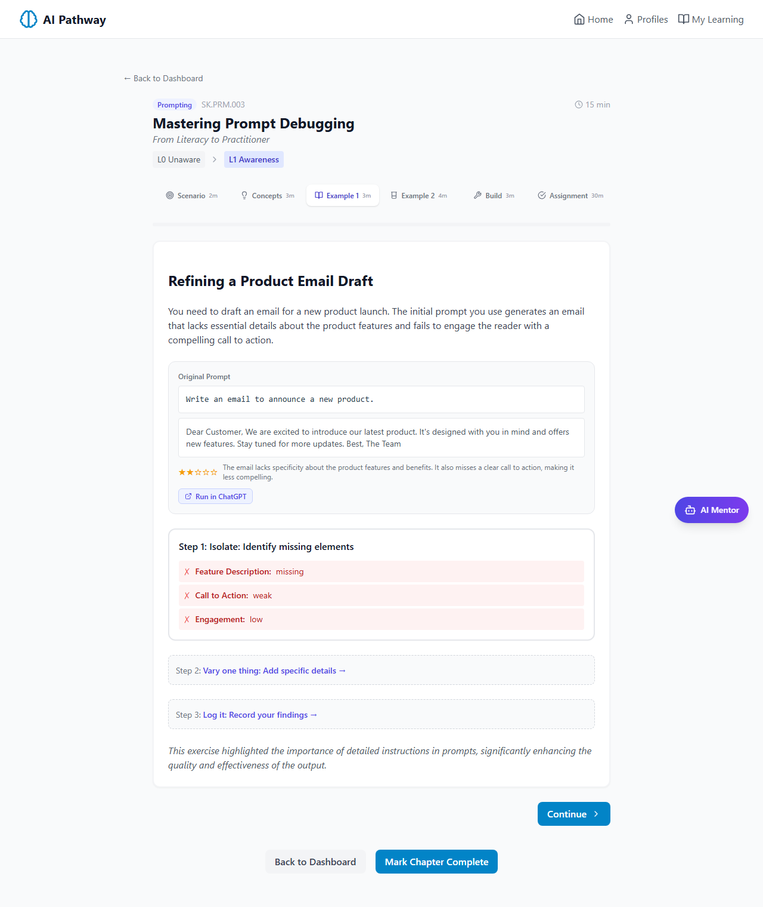
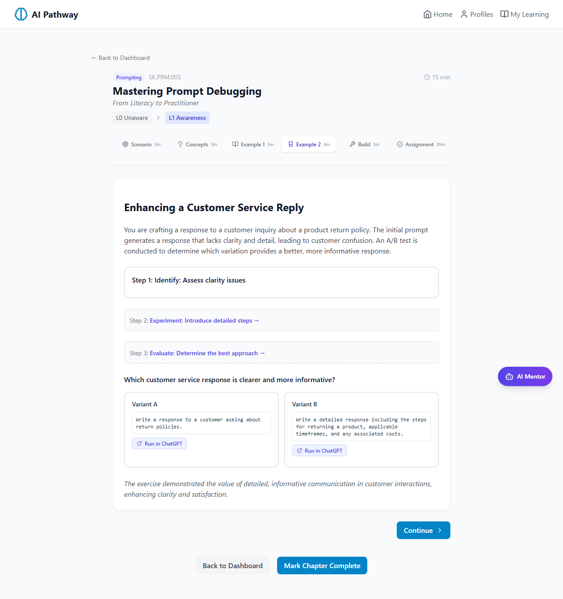
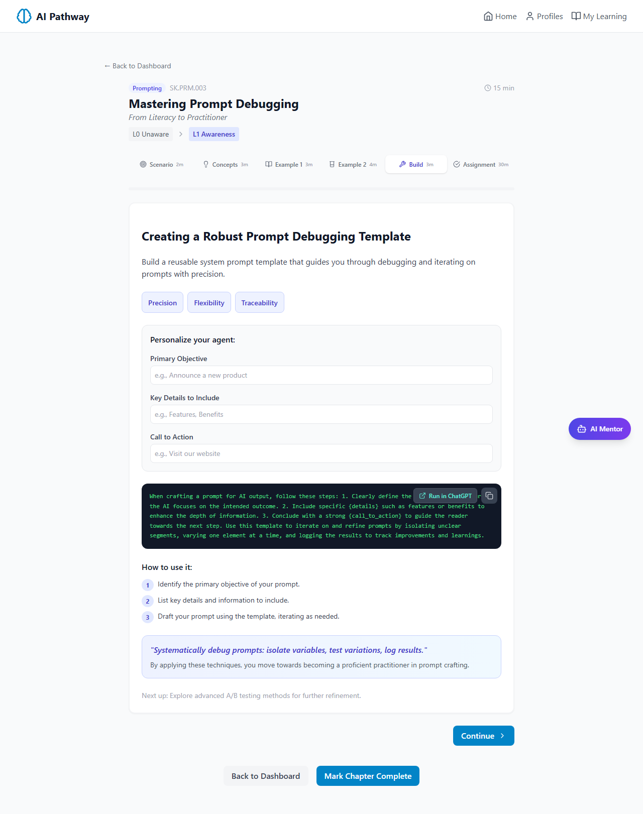
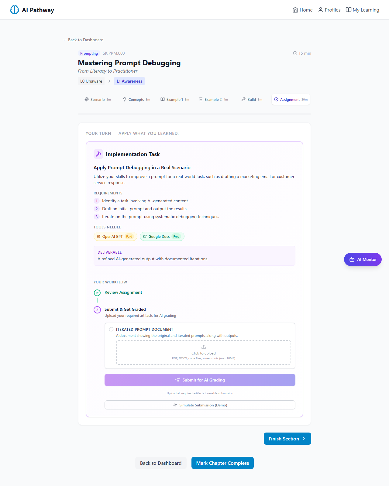

# AI Pathway - Apr 30 E2E Verification Report

This report covers all changes deployed during the Apr 28-30 sprint:

- Luda Apr 28 fixes: deterministic skill ordering, removed duplicate text, end-of-page messaging, removed Journey Roadmap and Ready to Start pages
- Vivek Apr 29 critique: chapter depth + Try-in-LLM buttons
- Implementation task brought back as 6th chapter section

## Section 1: Simplified Homepage

Per Luda Apr 15 feedback: removed 'How It Works' section and 'Ready to start your AI learning journey' CTA. Page fits on one screen.

## Section 2: Profiles Page

Updated copy: 'Create profiles for different career goals'. New profile button.

## Section 3: Skills Review (Top 5 + Self-Assessment Merged)

Per Luda: skill selection and proficiency rating merged into one page. Skills shown in deterministic priority order. Duplicate rationale text removed from each skill row.

**Top 5 chapters generated for this Jennifer C profile:**
1. `SK.PRM.003`
2. `SK.FND.002`
3. `SK.PRM.020`
4. `SK.GOV.022`
5. `SK.EVL.001`

Note: Verified deterministic across 20 consecutive runs.

## Section 4: Learning Dashboard (Auto-Activated)

Per Luda Apr 28: 'Your Journey Roadmap' and 'Ready to Start Learning' pages removed. Continue to Learning Path goes directly here. Path auto-activates on load - no gate.

## Section 5: New Chapter Format

Vivek's 5-section chapter + new 6th implementation task section. Section navigation visible at top with Scenario (2m), Concepts (3m), Example 1 (3m), Example 2 (4m), Build (3m), Assignment (30m).

## Section 6: Chapter Content Audit

**Skill:** SK.PRM.003 - Prompt debugging & iteration
**Level gap:** L0 -> L1

**Sections present:**
- OK scenario
- OK concepts
- OK example_1
- OK example_2
- OK agent_build
- OK implementation_task

**Concepts section:**
- mnemonic: `IVL = Isolate, Vary, Log`
- pull_quote: "Effective debugging is a blend of systematic analysis and creative iteration."
- cards: 3 populated

**Example 1 (structured steps):**
- original_prompt + iterated_prompt with full text and ratings
- steps array: 3 entries with content_types: ['diagnosis_checklist', 'prompt_variant', 'log_entry']

**Example 2 (A/B comparison):**
- 2 variants
- test_question: "Which customer service response is clearer and more informative?"
- takeaway: "Including specific procedures and details in customer service responses significantly improves clarity and customer satisfaction."

**Agent Build (Section 5):**
- capability_chips: 3
- personalization_fields: 3 (objective, details, call_to_action)
- system_prompt_template: 81 words

### Per-section screenshots

**Scenario (Section 1)**

**Concepts (Section 2)**

**Example 1 (Section 3)**

**Example 2 - A/B comparison (Section 4)**

**Agent Build (Section 5)**

**Implementation Task / Assignment (Section 6 - NEW)**

## Section 7: Implementation Task (NEW 6th Section)

**Title:** Apply Prompt Debugging in a Real Scenario

**Description:** Utilize your skills to improve a prompt for a real-world task, such as drafting a marketing email or customer service response.

**Requirements:**
- Identify a task involving AI-generated content.
- Draft an initial prompt and output the results.
- Iterate on the prompt using systematic debugging techniques.

**Deliverable:** A refined AI-generated output with documented iterations.

**Estimated minutes:** 45

**Tools:**
- OpenAI GPT (paid)
- Google Docs (free)

**Evidence requirements (uploaded for AI grading):**
- **Iterated Prompt Document** (PDF): A document showing the original and iterated prompts, along with outputs.

Per user's Apr 30 feedback: assignment workflow brought back from old multi-lesson format. Independent of the agent built in Section 5. Submit & Get Graded uses existing AI grading endpoint. Mentor briefing step hidden via `hideMentorStep` prop.

## Section 8: Try-in-LLM Buttons (Vivek Apr 29 Request)

'Run in ChatGPT' / 'Run in Claude' buttons added to 4 locations in ChapterRenderer:

1. `original_prompt` in Example 1
2. `iterated_prompt` in Example 1 (revealed after step 2)
3. Each variant prompt in Example 2 A/B comparison
4. Interpolated `system_prompt_template` in Agent Build (sends user's filled-in version)

Reuses existing `openInLLM`, `getRunLabel`, `getPreferredLLM` utilities. Listens for `llm-changed` custom event so labels update when user switches LLM in chooser.

---

## Verification Summary

| Item | Status |
|---|---|
| Homepage simplification | OK |
| Profiles page copy update | OK |
| Deterministic skill ordering | OK (20 consecutive runs identical) |
| Duplicate rationale text removed | OK |
| End-of-page messaging updated | OK |
| Journey Roadmap page removed | OK |
| Ready to Start gate removed | OK (auto-activates) |
| Chapter format with all 5 Vivek sections | OK |
| Concept mnemonic + pull_quote present | OK |
| Example 1 steps array (diagnosis/variant/log) | OK |
| Example 2 A/B comparison with takeaway | OK |
| Agent Build with capability_chips, personalization_fields, system_prompt_template | OK |
| **Implementation task as 6th section** | **OK (NEW)** |
| **Try-in-LLM buttons in chapter** | **OK (NEW)** |
| Depth-driven retry pass | OK (10 warnings -> 2-3 after retry) |

**Depth verification: 42/45 checks pass on freshly generated chapter (was 27/42 before this sprint).**
