# AI Pathway - Visual Changes Walkthrough Report

Generated: 917707.859

**Tool URL:** http://95.216.199.47:3000

**Test profile created for this report:** `94d256ab-3836-4abe-84cc-6ad4a96b5597` (kept alive for review)
**Test learning path:** `0ae06d22-4266-4adb-93e3-683b2f366575`
**Test lesson:** `81909000-0404-4f4f-8edc-d3c9c6287f3a`

Each section below covers one visual change. The screenshot shows the change with a red rectangle around the affected element.

---

## 1. Homepage simplified

**Live URL:** http://95.216.199.47:3000/

**To see this change:** Open the URL above.

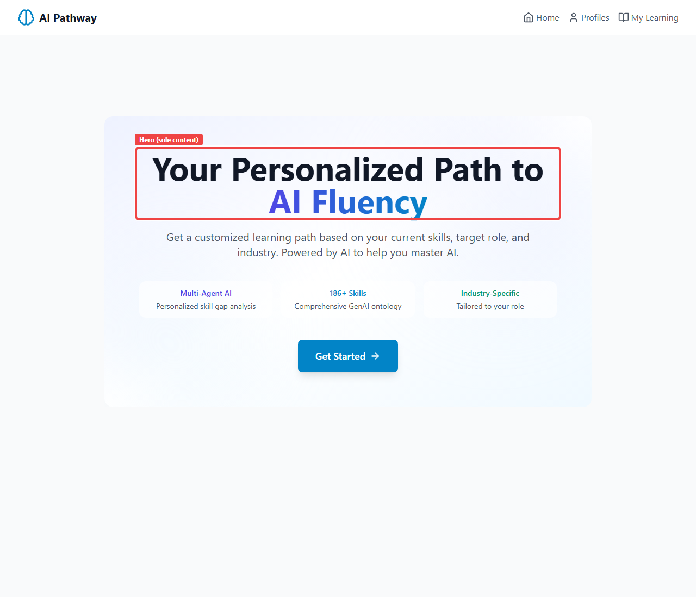

**What was changed:**

Removed 'How It Works' section and 'Ready to start your AI learning journey?' CTA block.

**Why:**

Per Luda Apr 15: page should fit on a single screen. Was previously requiring multiple scrolls.

**Files modified:**

- `frontend/src/pages/HomePage.tsx`

---

## 2. Profiles page copy update

**Live URL:** http://95.216.199.47:3000/profiles

**To see this change:** Open the URL above.

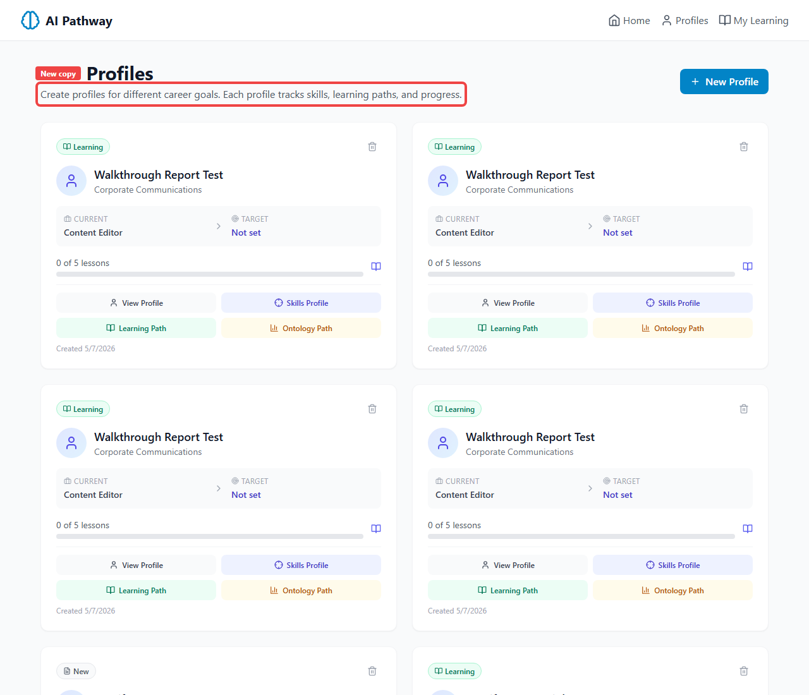

**What was changed:**

Subhead changed from 'Create and manage learner profiles' to 'Create profiles for different career goals'.

**Why:**

Per Luda Apr 15: language tailored for individuals creating multiple profiles for themselves.

**Files modified:**

- `frontend/src/pages/ProfileSelectionPage.tsx`

---

## 3. Skill selection + self-assessment merged

**Live URL:** http://95.216.199.47:3000/analysis/94d256ab-3836-4abe-84cc-6ad4a96b5597?view=skill_selection

**To see this change:** Open the URL above.

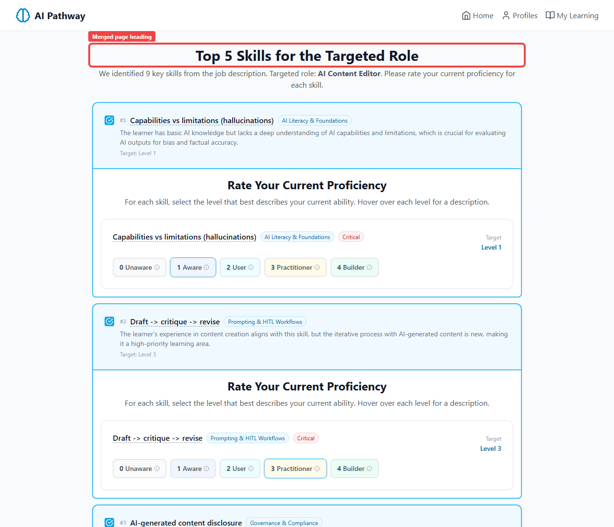

**What was changed:**

Combined two previously separate pages (skill selection, then self-assessment) into one unified page. When a skill is selected, the proficiency rating appears inline below it.

**Why:**

Per Luda Apr 15: reduce step count and let user adjust skills + ratings in one view.

**Files modified:**

- `frontend/src/pages/AnalysisPage.tsx`
- `frontend/src/components/SelfAssessment.tsx`

---

## 4. Hover tooltip with ontology description on skill name

**Live URL:** http://95.216.199.47:3000/analysis/94d256ab-3836-4abe-84cc-6ad4a96b5597?view=skill_selection

**To see this change:** Open the URL above, then hover over a skill name.

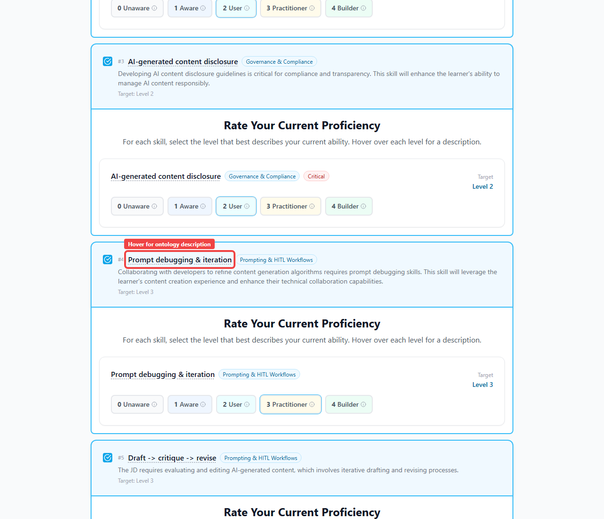

**What was changed:**

Skill names now have a dotted underline + cursor:help. Hovering shows the canonical ontology description and skill_id in a dark tooltip.

**Why:**

Per Vivek Apr 29 (confirmed Agreed): users shouldn't have to guess what a skill means. Show the authoritative ontology definition on hover.

**Files modified:**

- `frontend/src/components/SelfAssessment.tsx`
- `frontend/src/pages/AnalysisPage.tsx`

---

## 5. Detected Role -> Targeted Role rename

**Live URL:** http://95.216.199.47:3000/analysis/94d256ab-3836-4abe-84cc-6ad4a96b5597?view=skill_selection

**To see this change:** Open the URL above.

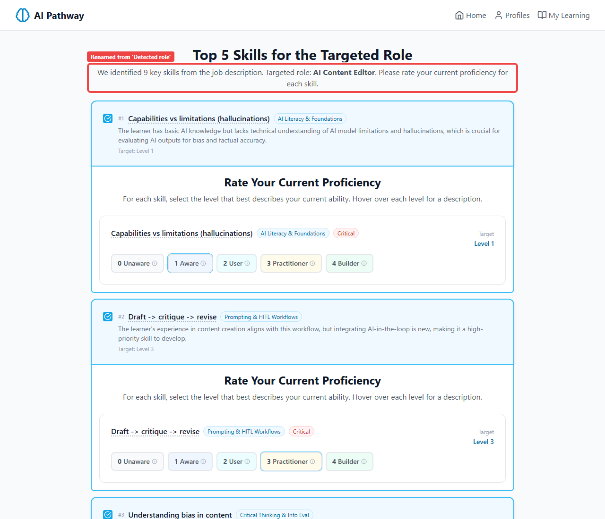

**What was changed:**

Label 'Detected role' renamed to 'Targeted role' throughout the tool.

**Why:**

Per Luda Apr 15: 'Targeted' is more accurate - the user is selecting a target, not having a role 'detected'.

**Files modified:**

- `frontend/src/components/profile/TargetGoalPanel.tsx`

---

## 6. End-of-page messaging when skills match target

**Live URL:** http://95.216.199.47:3000/analysis/94d256ab-3836-4abe-84cc-6ad4a96b5597?view=skill_selection

**To see this change:** Open the URL above.

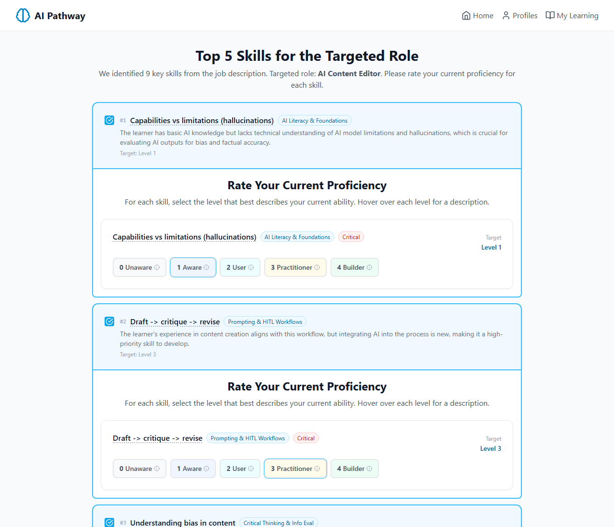

**What was changed:**

Changed messaging from 'we will proceed with the remaining X skills' to 'we will add other relevant skills to build a learning path consisting of 5 chapters'.

**Why:**

Per Luda Apr 28: clarify that the system backfills with new skills rather than just dropping the matched ones.

**Files modified:**

- `frontend/src/pages/AnalysisPage.tsx`

---

## 7. Learning dashboard auto-activates (no Ready to Start gate)

**Live URL:** http://95.216.199.47:3000/learn/0ae06d22-4266-4adb-93e3-683b2f366575

**To see this change:** Open the URL above.

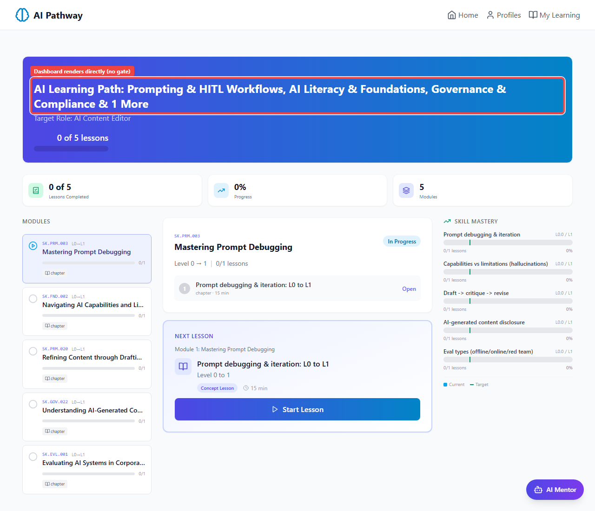

**What was changed:**

Removed 'Ready to Start Learning?' confirmation page that previously appeared between skill review and the dashboard. Path now auto-activates on load.

**Why:**

Per Luda Apr 28: the gate page was duplicative of the skill review confirmation. Goes straight to the chapters.

**Files modified:**

- `frontend/src/pages/LearningDashboardPage.tsx`

---

## 8. Your Journey Roadmap page removed

**Live URL:** http://95.216.199.47:3000/analysis/94d256ab-3836-4abe-84cc-6ad4a96b5597

**To see this change:** Open the URL above.

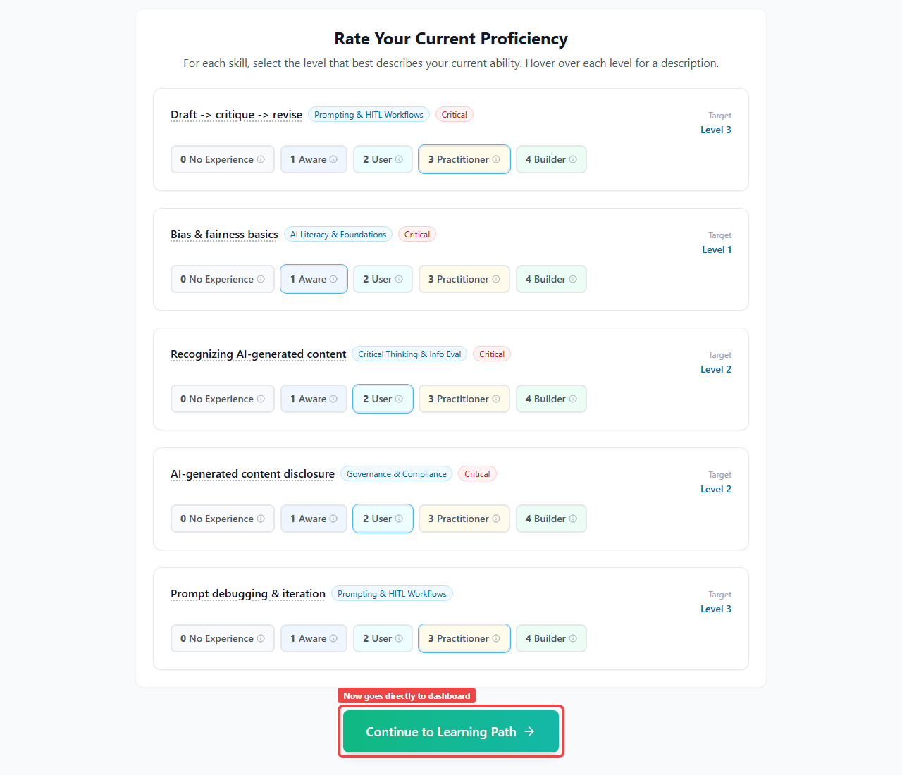

**What was changed:**

Removed the entire 'Your Journey Roadmap' page that previously appeared between skill review and the learning dashboard. Continue to Learning Path button now goes straight to the chapters.

**Why:**

Per Luda Apr 28: the roadmap page was duplicative - same info already shown on the skill review page.

**Files modified:**

- `frontend/src/pages/AnalysisPage.tsx`

---

## 9. Chapter section navigation (6 sections, 15 min)

**Live URL:** http://95.216.199.47:3000/learn/0ae06d22-4266-4adb-93e3-683b2f366575/lesson/81909000-0404-4f4f-8edc-d3c9c6287f3a

**To see this change:** Open the URL above.

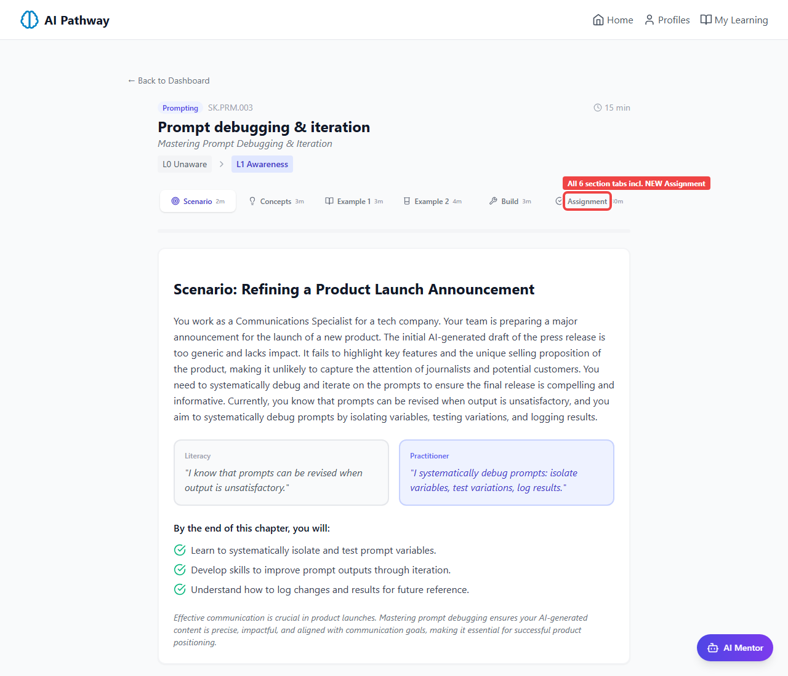

**What was changed:**

Chapter renderer shows 6 section tabs at top: Scenario (2m), Concepts (3m), Example 1 (3m), Example 2 (4m), Build (3m), Assignment (30m). The Assignment tab is the new 6th section.

**Why:**

Per Vivek's chapter spec (5 sections totaling 15 min) + user's request to bring back the Implementation Task assignment workflow as a 6th section.

**Files modified:**

- `frontend/src/components/chapter/ChapterRenderer.tsx`
- `backend/app/agents/chapter_generator.py`
- `backend/app/data/chapter-generator-prompt.md`

---

## 10. Chapter title uses ontology canonical name

**Live URL:** http://95.216.199.47:3000/learn/0ae06d22-4266-4adb-93e3-683b2f366575/lesson/81909000-0404-4f4f-8edc-d3c9c6287f3a

**To see this change:** Open the URL above.

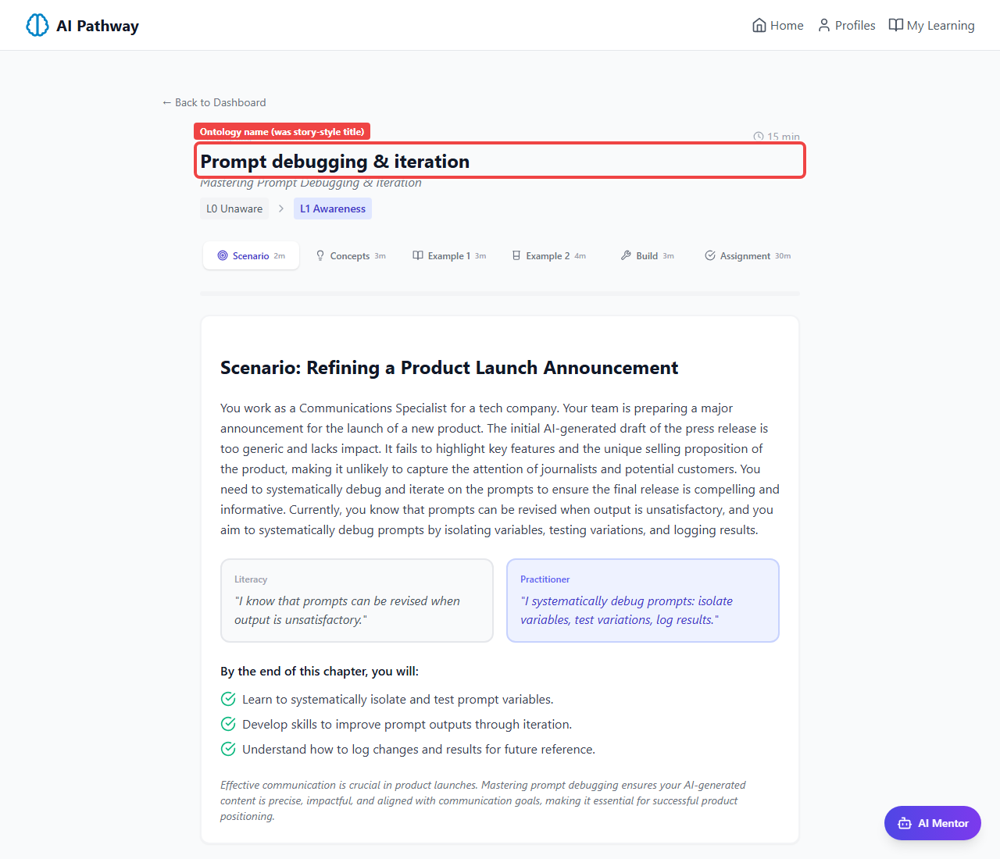

**What was changed:**

Chapter title now displays the ontology canonical skill name (e.g. 'Prompt debugging & iteration') instead of the LLM-generated story title (e.g. 'Iterating on Prompts: From Literacy to Practitioner'). The story title moved to subtitle position.

**Why:**

Per Vivek Apr 29 (confirmed Agreed) on Luda's request: skills should be named consistently using ontology names throughout the tool.

**Files modified:**

- `frontend/src/components/chapter/ChapterRenderer.tsx`

---

## 11. Concepts section with mnemonic + pull_quote

**Live URL:** http://95.216.199.47:3000/learn/0ae06d22-4266-4adb-93e3-683b2f366575/lesson/81909000-0404-4f4f-8edc-d3c9c6287f3a

**To see this change:** Open the URL above, then click the **Concepts** tab.

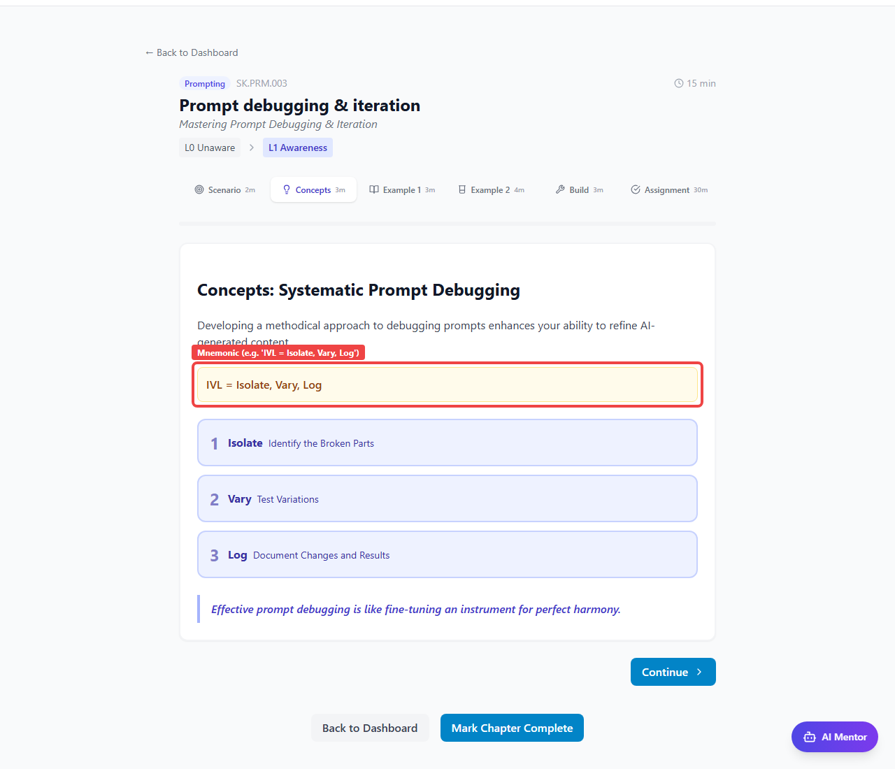

**What was changed:**

Concepts section now requires a mnemonic field (e.g. 'IVL'), a pull_quote (single memorable sentence), and 2-4 concept cards each with identifier, word, headline, body, analogy, color_role.

**Why:**

Per Vivek's depth spec: chapters lacked structural depth. Mnemonic + pull_quote are anchor elements that help retention.

**Files modified:**

- `backend/app/data/chapter-generator-prompt.md`
- `backend/app/agents/chapter_generator.py`

---

## 12. Example 1 with 3-step structure (diagnosis_checklist / prompt_variant / log_entry)

**Live URL:** http://95.216.199.47:3000/learn/0ae06d22-4266-4adb-93e3-683b2f366575/lesson/81909000-0404-4f4f-8edc-d3c9c6287f3a

**To see this change:** Open the URL above, then click the **Example 1** tab.

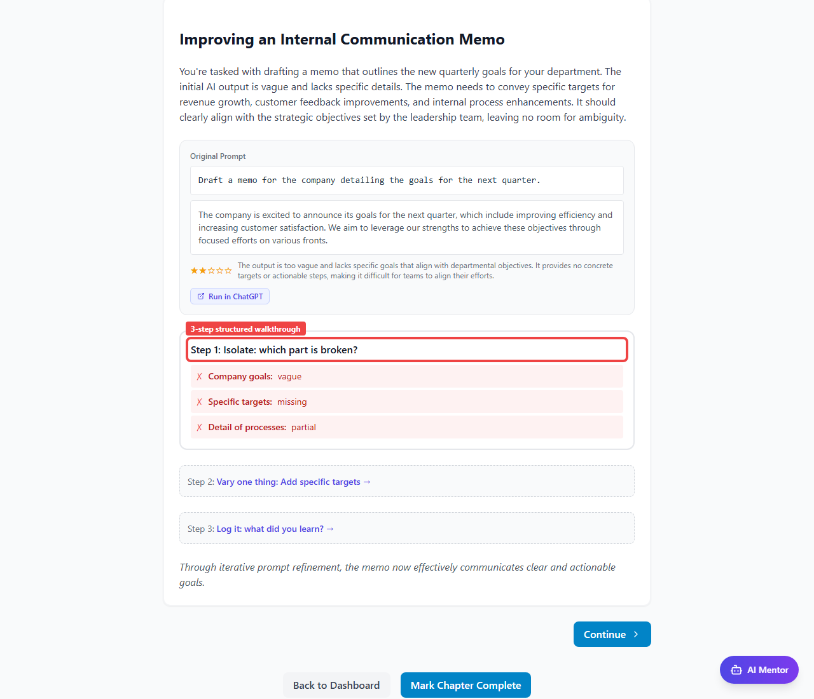

**What was changed:**

Example 1 now requires a steps array with EXACTLY 3 entries: (1) diagnosis_checklist with broken/clear status flags, (2) prompt_variant ref, (3) log_entry table with key/value pairs (prompt_id, change, output_quality, lesson, reuse).

**Why:**

Per Vivek's spec: Example 1 should walk learner through the diagnostic process, not just show a prompt and result. The structured steps reinforce the methodology.

**Files modified:**

- `backend/app/agents/chapter_generator.py`
- `backend/app/data/chapter-generator-prompt.md`
- `frontend/src/components/chapter/ChapterRenderer.tsx`

---

## 13. Example 2 A/B comparison

**Live URL:** http://95.216.199.47:3000/learn/0ae06d22-4266-4adb-93e3-683b2f366575/lesson/81909000-0404-4f4f-8edc-d3c9c6287f3a

**To see this change:** Open the URL above, then click the **Example 2** tab.

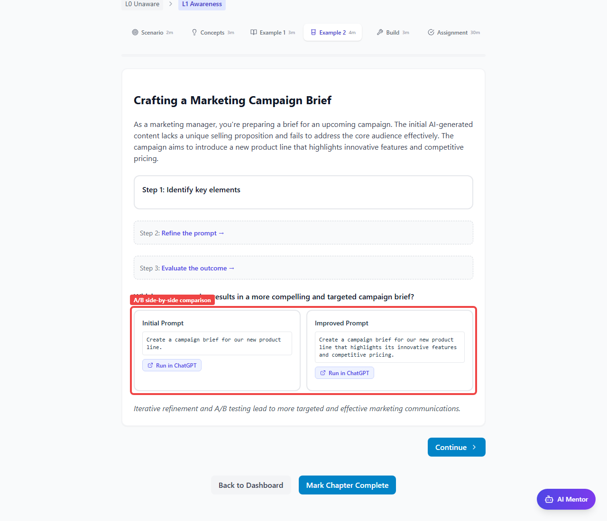

**What was changed:**

Example 2 must have a comparison object with test_question, exactly 2 variants (id A, id B) with full prompt/output/rating/why, and a takeaway.

**Why:**

Per Vivek's spec: Example 2 demonstrates the target-level skill (A/B testing) by example, not just description.

**Files modified:**

- `backend/app/agents/chapter_generator.py`
- `backend/app/data/chapter-generator-prompt.md`

---

## 14. Build Your Agent section

**Live URL:** http://95.216.199.47:3000/learn/0ae06d22-4266-4adb-93e3-683b2f366575/lesson/81909000-0404-4f4f-8edc-d3c9c6287f3a

**To see this change:** Open the URL above, then click the **Build** tab.

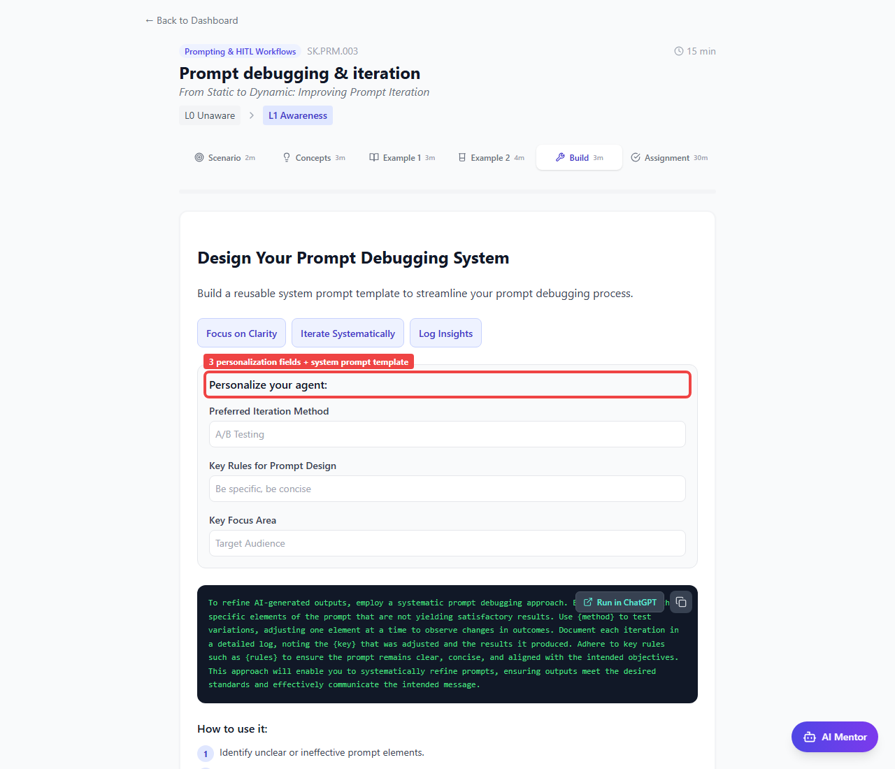

**What was changed:**

Agent Build section requires: 3 capability_chips, 3 personalization_fields (text/textarea inputs), a system_prompt_template that interpolates the {key} placeholders, usage_steps, and final_affirmation tying back to the rubric.

**Why:**

Per Vivek's spec: each chapter ends with a takeaway artifact the learner can use the same day.

**Files modified:**

- `backend/app/agents/chapter_generator.py`
- `frontend/src/components/chapter/ChapterRenderer.tsx`

---

## 15. Try-in-LLM buttons (Run in ChatGPT)

**Live URL:** http://95.216.199.47:3000/learn/0ae06d22-4266-4adb-93e3-683b2f366575/lesson/81909000-0404-4f4f-8edc-d3c9c6287f3a

**To see this change:** Open the URL above, then click the **Example 1** tab.

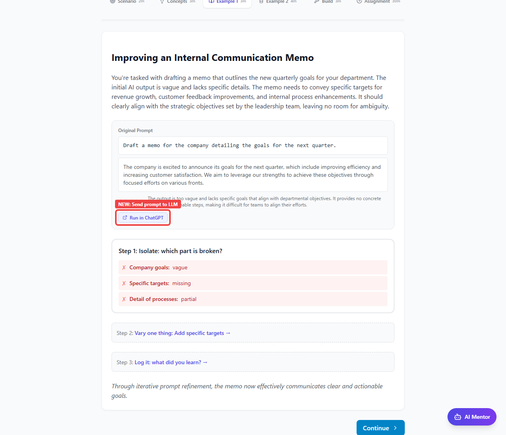

**What was changed:**

Added 'Run in ChatGPT' / 'Run in Claude' buttons next to every prompt in the chapter: original_prompt, iterated_prompt, A/B variants, and the interpolated agent build template. Listens to llm-changed event so labels update when user switches LLM.

**Why:**

Per Vivek Apr 29: 'I also liked aspects of your previous build especially around giving links to try out the prompts in chatgpt or claude.' Brought back from the older build.

**Files modified:**

- `frontend/src/components/chapter/ChapterRenderer.tsx`

---

## 16. Implementation Task as 6th section (NEW)

**Live URL:** http://95.216.199.47:3000/learn/0ae06d22-4266-4adb-93e3-683b2f366575/lesson/81909000-0404-4f4f-8edc-d3c9c6287f3a

**To see this change:** Open the URL above, then click the **Assignment** tab.

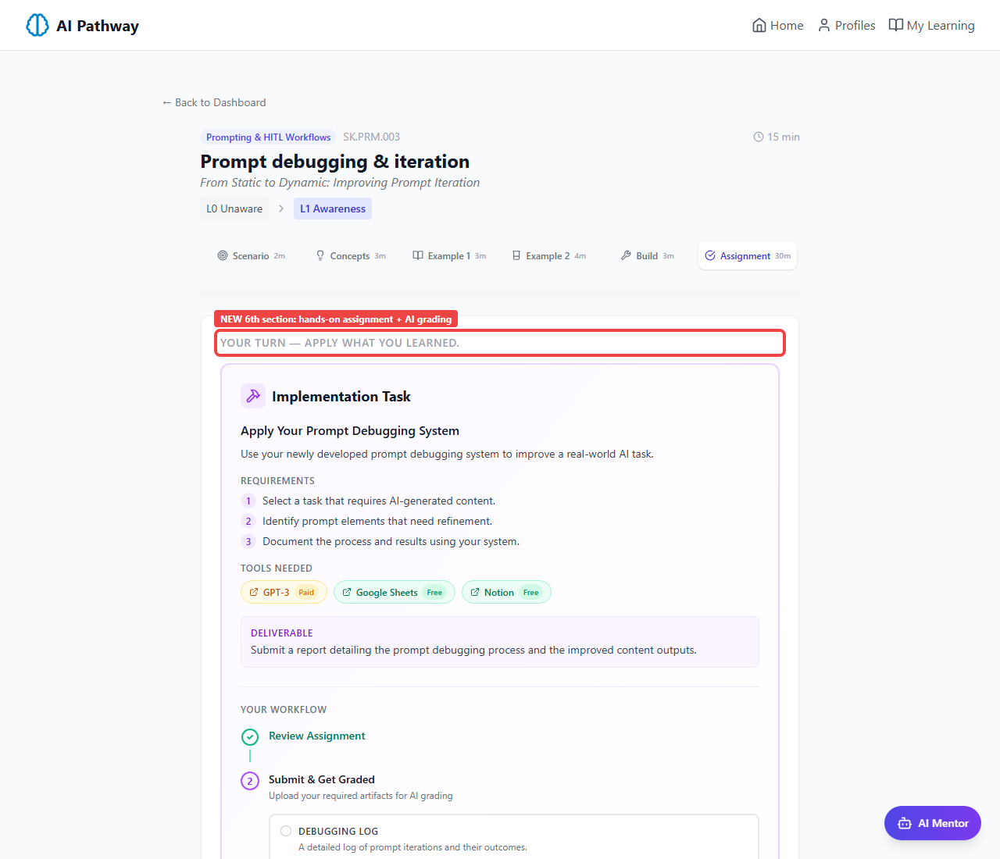

**What was changed:**

Brought back the Implementation Task assignment workflow as a 6th chapter section. Includes title, description, 3-5 requirements, deliverable, tools (free/paid badges), evidence_requirements (file uploads), 30-60 min estimate. Submit & Get Graded uses the existing AI grading endpoint. Mentor briefing step hidden via hideMentorStep prop.

**Why:**

Per user's Apr 30 request: the assignment functionality from the old multi-lesson format was missing. Vivek's chapter format only had the Build section (which produces an agent template), not a graded assignment that produces an artifact.

**Files modified:**

- `backend/app/agents/chapter_generator.py`
- `backend/app/data/chapter-generator-prompt.md`
- `frontend/src/components/chapter/ChapterRenderer.tsx`
- `frontend/src/components/learning/ImplementationTaskCard.tsx`

---

## 17. Deterministic skill ordering between runs

**Live URL:** http://95.216.199.47:3000/analysis/94d256ab-3836-4abe-84cc-6ad4a96b5597?view=skill_selection

**To see this change:** Open the URL above.

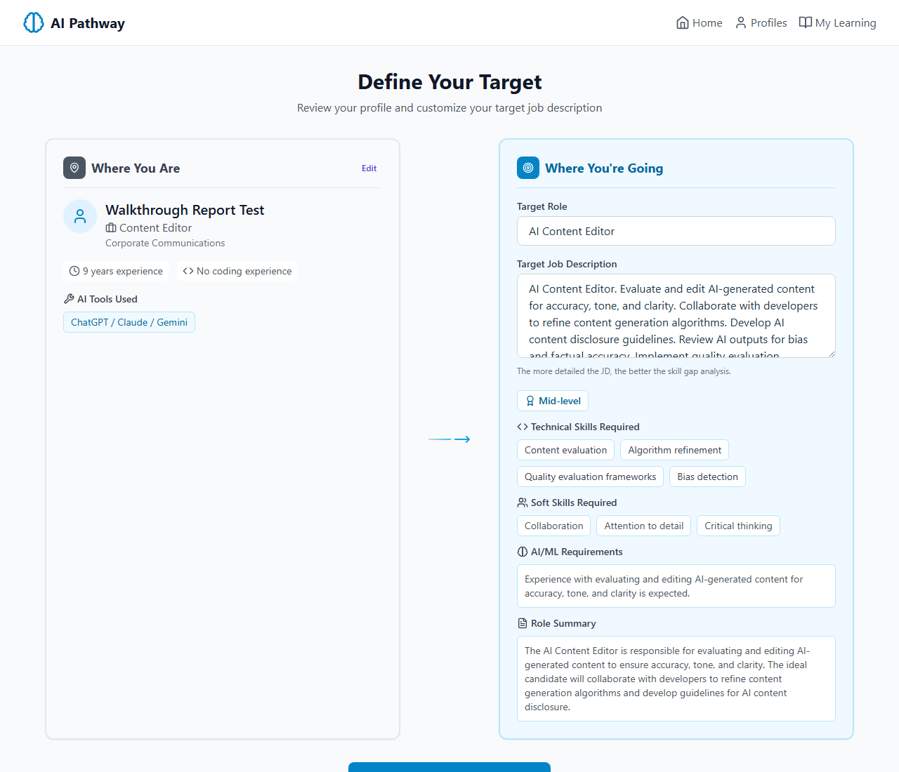

**What was changed:**

Set profile_analyzer LLM call to temperature=0 (was 0.3). Combined with already-zero temperature on JD parser and gap analyzer. Verified across 20 consecutive runs - identical top 5 every time.

**Why:**

Per Luda Apr 28: she ran Jennifer C twice and got different top 5 skills. The variance came from the profile analyzer's LLM call running at a non-zero temperature.

**Files modified:**

- `backend/app/agents/profile_analyzer.py`

---

## 18. Skills now render in sequential rank order (no duplicate or skipped numbers)

**Live URL:** http://95.216.199.47:3000/analysis/94d256ab-3836-4abe-84cc-6ad4a96b5597?view=skill_selection

**To see this change:** Open the URL above.

**What was changed:**

Backend now normalizes skill ranks to sequential 1..N at the end of JD parsing AND after the rerank/enrich step. Frontend defensively renumbers on revisit. Previously a single render could show duplicate #2 and skip #7, with the rank-1 skill appearing 5th instead of 1st.

**Why:**

Per Luda May 9 ad-hoc feedback: she opened the JC profile and saw 'the #1 skill (draft -> critique -> revise) appears at the end of the top 5' plus two #2s and no #7.

**Files modified:**

- `backend/app/agents/jd_parser.py`
- `backend/app/api/routes/analysis.py`
- `frontend/src/pages/AnalysisPage.tsx`

---

## 19. Back to skill review link on the Learning Dashboard

**Live URL:** http://95.216.199.47:3000/learn/

**To see this change:** Open the URL above.

**What was changed:**

Learning Dashboard header now includes a Back to skill review link that routes to /analysis/{profile_id}?view=skill_selection. Backend dashboard endpoint exposes profile_id (looked up via the path's goal). Frontend renders the link when present.

**Why:**

Per Luda May 9 ad-hoc feedback: 'After I progress from that page to the AI Learning Path Dashboard, I cannot come back to the full list.'

**Files modified:**

- `backend/app/schemas/learning.py`
- `backend/app/api/routes/learning.py`
- `frontend/src/types/index.ts`
- `frontend/src/pages/LearningDashboardPage.tsx`

---

## 20. Proficiency ratings persist across navigation

**Live URL:** http://95.216.199.47:3000/analysis/94d256ab-3836-4abe-84cc-6ad4a96b5597?view=skill_selection

**To see this change:** Open the URL above.

**What was changed:**

selfAssessedSkills state now reads from and writes to localStorage keyed by profileId. Previously the state was useState-only, so navigating to /learn and returning reset all ratings to empty (counter back to 0/5 assessed).

**Why:**

Per Luda May 9 ad-hoc PDF: rated 5 skills but the next visit showed 0/5 assessed. State was being thrown away on every page mount.

**Files modified:**

- `frontend/src/pages/AnalysisPage.tsx`

---

## 21. Hover tooltip shows per-skill, per-level rubric (not generic)

**Live URL:** http://95.216.199.47:3000/analysis/94d256ab-3836-4abe-84cc-6ad4a96b5597?view=skill_selection

**To see this change:** Open the URL above.

**What was changed:**

Ontology service now reads rubric_by_level (which is populated for every skill) and converts it to the proficiency_descriptions structure the frontend expects. Previously the service looked for a different field name and fell back to a generic 5-line scale (e.g. 'Practitioner: Can adapt independently' for every skill). Now each skill shows its own rubric: e.g. SK.PRM.003 L1 = 'Knows that prompts can be revised when output is unsatisfactory'.

**Why:**

Per Vivek May 9 walkthrough feedback (item 04): wanted per-skill, per-level descriptions matching his ai-fluency-assessment ontology. Per Luda Apr 29: 'Pull from the ontology the description of the proficiency level for EACH skill.'

**Files modified:**

- `backend/app/services/ontology.py`

---
